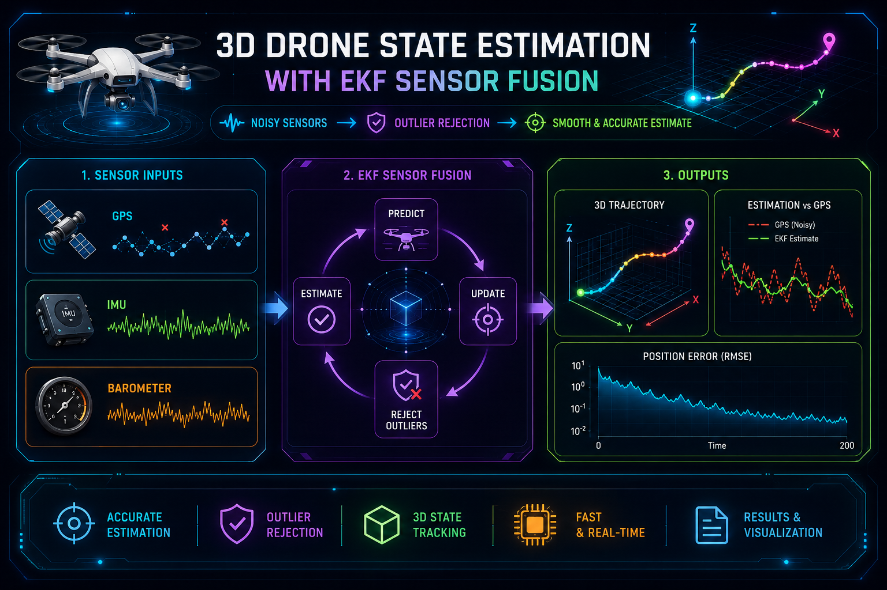

# 3D Drone State Estimation using Extended Kalman Filter Sensor Fusion



## Overview

This project implements a multi-sensor state estimation framework for autonomous aerial vehicles using an Extended Kalman Filter (EKF). The system fuses GPS position measurements, IMU acceleration data, and barometric altitude observations to estimate the vehicle state in three dimensions. The implementation supports both real PX4 flight logs and a synthetic simulation environment for testing and benchmarking.

The project focuses on practical state estimation challenges including sensor noise, measurement outliers, uncertainty propagation, and trajectory reconstruction. It provides a reproducible workflow for evaluating EKF-based navigation performance using real-world flight data.

## Key Features

* Extended Kalman Filter state estimation
* GPS, IMU, and barometer sensor fusion
* PX4 flight log support
* Automatic public PX4 log download
* GPS outlier rejection using Mahalanobis gating
* Monte Carlo robustness evaluation
* 3D trajectory visualization
* RMSE and error analysis
* CUDA acceleration where applicable

## Tested Environment

| Component  | Version |
| ---------- | ------- |
| Ubuntu     | 24.04   |
| Python     | 3.12    |
| NumPy      | Latest  |
| Pandas     | Latest  |
| Matplotlib | Latest  |

## Quick Start

Install dependencies:

```bash
pip install -r requirements.txt
```

Run the complete pipeline:

```bash
python main.py
```

The script automatically:

1. Searches for local PX4 logs
2. Downloads a public PX4 log if needed
3. Extracts sensor measurements
4. Runs EKF state estimation
5. Generates plots
6. Exports benchmark results

## Expected Outputs

After execution:

```text
outputs/
├── flight_estimation_results.csv
└── monte_carlo_results.csv

figures/
├── trajectory_3d.png
├── position_error.png
└── altitude_estimation.png
```

## Example Results

| Metric             | Raw GPS | EKF Estimate |
| ------------------ | ------- | ------------ |
| Position RMSE      | Higher  | Lower        |
| Altitude Stability | Poor    | Improved     |
| Noise Sensitivity  | High    | Reduced      |

## Methodology

State Vector:

```text
[x, y, z, vx, vy, vz]
```

Sensors:

* GPS position
* IMU acceleration
* Barometer altitude

Filtering:

* EKF prediction/update cycle
* Measurement covariance modeling
* Statistical outlier rejection

## Troubleshooting

### PX4 log cannot be parsed

Verify that the `.ulg` file contains GPS and estimator topics.

### CUDA not detected

```bash
python -c "import torch; print(torch.cuda.is_available())"
```

### No PX4 log found

The project automatically switches to simulation mode.

## References

* PX4 Flight Review
* Extended Kalman Filter theory
* Probabilistic Robotics
